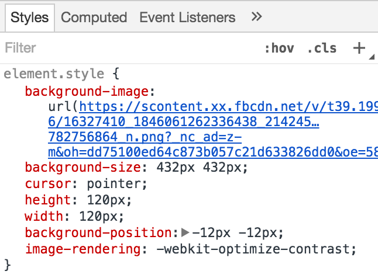
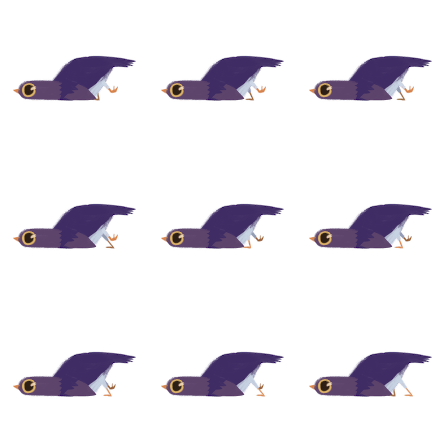

# facebook_sticker_extract
This tool extracts every frame of an animated Facebook sticker.

# Usage
1. Open a Messenager chat session and send your friend the animated sticker you'd like to extract.
2. Right-click the sticker you just sent. Click "inspect" and you can see:



3. Right-click on that highlighted URL, click "open".
4. Right-click on the new-opened image, save it under your clone of this repository and name it "stickers.png"
5. Open that image and take a look. For example:



The format of this sticker is:

```
X  X  X
X  X  X
X  X  X
```

And change the `table` variable in [extract.py](extract.py) accordingly.
For the image mentioned above you should assign `[3, 3, 3]` to variable `table`.
Let me give you another example. If there's another sticker which has a format like this:

```
X  X  X  X  X
X  X  X  X  X
```

Then you should assign `[5, 5]` this time. As well as:

```
X  X  X  X
X  X  X  X
X  X  X  X
X  X  X 
```

Assign `[4, 4, 4, 3]`.

6. `$ pip install Pillow; python ./extract.py`. Done!
